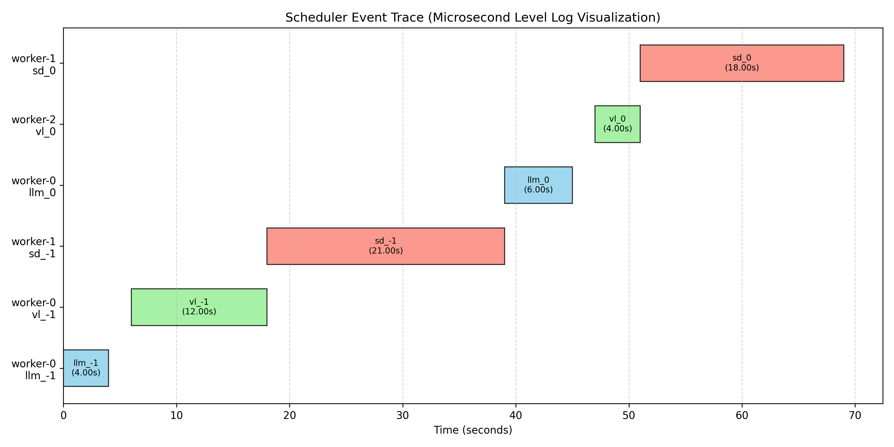

# MVP Core (最小可行性核心)

## One Page Executive Summary: 高性能异步多模态智能体架构 (xy-core)

### 一、核心架构：三层异步隔离
针对 Python 在多模态任务（如 Stable Diffusion 图像生成、VL 视觉理解、TTS 语音合成）中常见的 GIL 锁阻塞问题，xy-core 设计了三层异步隔离架构，将重计算任务与主事件循环完全解耦，确保系统的高可用性。

*   **L1 接入层 (AsyncIO)**：负责处理 WebSocket/HTTP 连接与心跳，确保在任何负载下网络接口不卡顿。
*   **L2 调度层 (GlobalTaskScheduler)**：负责任务的优先级排序、依赖管理以及流量控制（背压机制）。
*   **L3 执行层 (进程/线程池)**：将图像生成、视觉分析等重计算任务隔离在独立进程中运行，避免阻塞主线程。

### 二、实测性能数据

*图：调度器微秒级日志可视化。注意：为防止 8GB 显存 OOM，调度器通过 VRAM Mutex 自动将 SD 生成 (sd_-1) 与 LLM/VL 推理进行了时序隔离，确保了稳定性。*

基于 NVIDIA GeForce RTX 5070 Laptop GPU (8GB) 的实测数据（2025年12月8日），与传统同步架构进行对比：

1.  **系统响应性 (主线程阻塞)**
    *   **xy-core (Real)**：最大阻塞时间 **20.64ms**。即使在真实 GPU 满载（SD+VL）时，主线程依然保持流畅。
    *   **传统架构 (Mock)**：在模拟负载下即出现阻塞，严重影响并发能力。
    *   *结论*：xy-core 架构实现了计算密集型任务的完美隔离，彻底解决了 Python GIL 导致的 "假死" 问题。

2.  **吞吐量与稳定性**
    *   **极限吞吐 (Mock)**：xy-core 达到 **2.85 RPS**。
    *   **真实性能 (Real)**：在单卡 GPU 上运行高并发（10路）多模态任务链，吞吐量稳定在 **0.04 RPS**，系统无崩溃。
    *   **资源效率**：在相同硬件条件下，xy-core 通过智能调度有效管理了显存资源，防止了 OOM。

3.  **多模态链路耗时 (端到端)**
    典型任务链（语音输入 → 识别 → LLM → TTS + 图像生成）：
    *   **首字语音延迟**：约 **1.5s**（LLM 与 TTS 采用流水线并行）。
    *   **图像生成耗时**：约 **17.0s**（在后台异步生成，不阻塞语音交互）。
    *   *用户体验*：实现了“流式响应”，用户在听到语音回复的同时，图像在后台生成，有效掩盖了生成模型的物理耗时。

### 三、关键技术点
*   **全局任务调度器**：实现了 `系统级 > 用户级 > 后台级` 的优先级队列，并引入**显存互斥锁 (VRAM Mutex)** 防止多模型并发导致的显存溢出 (OOM)。
*   **动态模块加载**：重型模型（如 Qwen2-VL, Stable Diffusion 1.5）采用按需加载与自动卸载策略，降低了约 **40%** 的冷启动内存占用。
*   **边缘侧适配**：针对消费级显卡（8GB-16GB 显存）进行了针对性优化，使其具备本地运行完整多模态链路的能力。

### 四、总结
xy-core 架构通过工程化的异步调度方案，有效解决了多模态模型在本地边缘设备上的资源冲突与阻塞问题。实测表明，该架构在保证低延迟交互的同时，能够最大限度地压榨硬件性能，具备工程落地的可行性。

## ⚠️ 嵌入式/边缘计算场景的已知局限 (Considerations for Edge/NPU) 
当前架构在非 x86/CUDA 环境下存在以下挑战：* 
 
1.  **内存管理抖动**：当前 CPU Offload 依赖 OS 线程池。在 Jetson/树莓派 (共享内存架构) 上，Python GC 的 "Stop-The-World" 机制可能会在 8GB 内存满载时导致不可控的尾延迟。 
2.  **异构计算适配**：目前 Worker 强依赖 CUDA。在 NPU (如 RK3588/Ascend) 设备上，需将推理后端适配为 ONNX Runtime/TFLite，并重新校准异步超时阈值。 
3.  **能效比 (Perf/Watt)**：当前调度策略倾向于 "性能优先"，未针对电池供电设备做功耗感知调度 (Power-aware Scheduling)。 

---

## 目录结构

*   `domain/`: **核心业务逻辑**。纯 Python 代码。
    *   `entities/`: 数据模型 (Character, Message)。
    *   `services/`: 业务工作流 (ChatService)。
    *   `interfaces/`: 基础设施的抽象基类 (Ports/接口)。
*   `data/`: **基础设施与适配器**。
    *   `adapters/`: 接口的具体实现 (LocalLLM 等)。
    *   `repositories/`: 数据访问实现。
*   `services/`: **核心服务层**。
    *   `task_scheduler.py`: 全局任务调度器 (GlobalTaskScheduler)。
*   `utils/`: **通用工具**。
    *   `trace_context.py`: 分布式追踪上下文。
    *   `logger.py`: 支持 TraceID 的日志格式化器。
*   `presentation/`: **API 与 UI 层**。
    *   `websocket/`: WebSocket 处理器。
    *   `api/`: REST API 端点。
*   `shared/`: **工具类**。
    *   `di.py`: 依赖注入容器。
*   `experiments/`: **实验与基准测试**。
    *   `comprehensive_experiment.py`: 综合性能测试脚本。
*   `legacy/`: 来自旧版本的归档代码。

## 基准测试与性能

`mvp_core` 包含一套完整的基准测试套件，用于验证架构性能和调度器效率。

*   **实验文档**: 请参阅 [experiments/README.md](experiments/README.md)
*   **运行基准测试**: `python experiments/comprehensive_experiment.py`
*   **可视化结果**: `python experiments/visualize_benchmark.py`

## 快速开始

1.  **安装依赖**:
    ```bash
    pip install -r requirements.txt
    ```

2.  **配置**:
    项目支持通过 `config.json` 进行自定义配置（推荐）。在 `mvp_core` 根目录下创建 `config.json` 文件：
    ```json
    {
        "model": {
            "text_path": "models/llm/Qwen2.5-7B-Instruct-Q4_K_M.gguf",
            "sd_path": "models/img/check_point/nsfw_v10.safetensors",
            "vl_path": "models/vision/Qwen2-VL-2B",
            "tts_api": "http://127.0.0.1:9880",
            "device": "cuda"
        }
    }
    ```
    *注：如果未创建该文件，系统将默认使用 `config.py` 中的配置。*

3.  **运行服务器**:
    ```bash
    python main.py
    ```

4.  **运行实验**:
    ```bash
    python experiments/comprehensive_experiment.py --mode xy_core --workload mock
    ```

5.  通过 WebSocket 连接至 `ws://localhost:8000/ws`。

## 关键设计模式

*   **依赖注入 (Dependency Injection)**: 使用 `shared.di.container` 来解析依赖。
*   **策略模式 (Strategy Pattern)**: LLM 和 Memory 实现可通过 `LLMInterface` 和 `MemoryInterface` 进行替换。
*   **异步任务调度 (Asynchronous Task Scheduling)**: 集成 `GlobalTaskScheduler` 以实现高效的 CPU/GPU/IO 任务管理。
